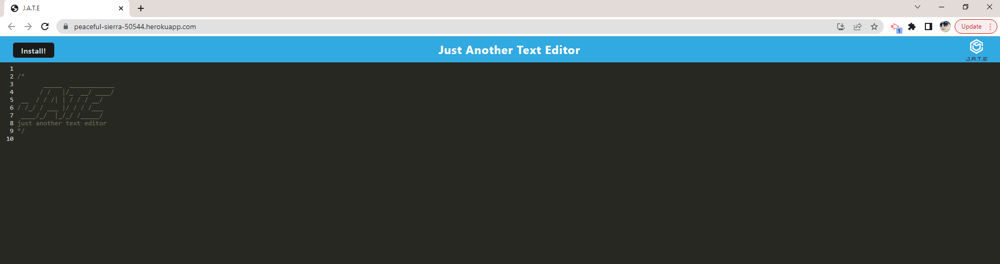

# PWA Text Editor

## Description:
For this project, I created a progressive web application for a text editor (single page application) that runs in the browser and is also installable to your desktop to run off-line.  The user's entered text will also persisit on the screen  upon closing and subsequentlky opening the application.   Links to the deployed application as well as the github repository where the code is housed are below: 

[Link to deployed web application](https://peaceful-sierra-50544.herokuapp.com/) 
[Link to Github Repository](https://github.com/AlexaP2022/PWA-Text-Editor)  
 
 

 
## Table of Contents
* [Installation](#installation)
* [Usage](#usage)
* [License](#license)
* [Contributors](#contributors)
* [Contact](#contact)
## Installation
To install this project, run 'npm i' to install all required dependencies.
## Usage
To test it's use, you can click the heroku link above or run the application from VS Code on local host by running 'npm run start' in the terminal after intalling all dependencies.
## License:

 This project is protected under MIT 
## Contributors
N/A
## Contact 
If you have any questions, please feel free to reach out below:  
-Github: [AlexaP2022](http://github.com/AlexaP2022)  
-Email: [alexapunzalan@gmail.com](mailto:user@example.com)